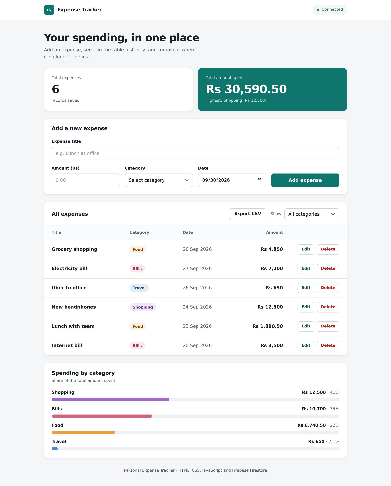
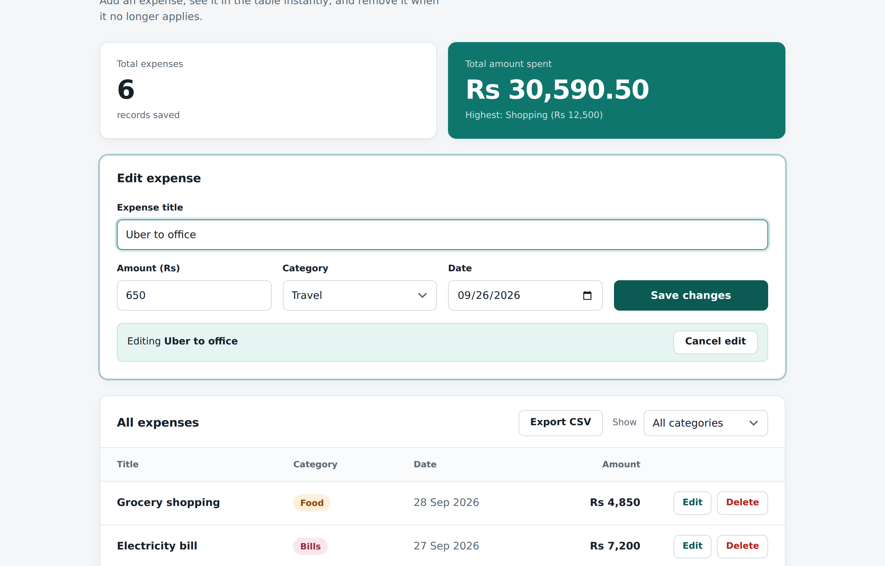

# Personal Expense Tracker

A simple web app to record and manage daily expenses. Every expense is stored in **Firebase Firestore**, shown in a table below the form, and can be deleted with one click. The app also shows the **total number of expenses** and the **total amount spent**.

**Live demo:** _add your Vercel URL here_
**Repository:** _add your GitHub URL here_



> The preview above uses sample data. Replace it with a screenshot of your own deployed app (see [Submission checklist](#submission-checklist)).

---

## Features

| Requirement | How it is built |
|---|---|
| Form with Title, Amount, Category, Date | `index.html`, validated in `js/app.js` |
| Categories: Food, Travel, Shopping, Bills, Other | `<select>` with the five fixed options |
| Store records in Firestore | `addDoc` in `js/db.js` (collection `expenses`) |
| Table of all saved expenses | Real-time listener (`onSnapshot`), newest date first |
| Delete button | `deleteDoc` with a confirmation prompt |
| Total number of expenses | Calculated from the live data |
| Total amount spent | Sum of all amounts, shown in Rs |
| Live deployment | Vercel (static hosting) |

**Extra features**

| Feature | Details |
|---|---|
| Edit expense | Edit button loads a row into the form; `updateDoc` saves the changes |
| Spending by category | Bar chart (pure CSS) showing each category's share of the total |
| Export CSV | Downloads the rows currently shown, safe against spreadsheet formula injection |
| Category filter | Filters the table; totals always cover every expense |
| Polish | Inline validation, toast messages, connection badge, responsive layout (rows become cards on phones), XSS-safe rendering (`textContent`, never `innerHTML`) |



## Tech stack

- HTML5, CSS3, vanilla JavaScript (ES modules, no build step)
- Firebase Firestore (modular SDK v10, loaded from the official CDN)
- Vercel for hosting

## Project structure

```
expense-tracker/
├── index.html              # page markup
├── css/
│   └── style.css           # design tokens and styles
├── js/
│   ├── firebase-config.js  # your Firebase keys (edit this)
│   ├── db.js               # Firestore: subscribe, add, update, delete
│   └── app.js              # UI: form, validation, table, totals
├── docs/                   # screenshots
├── firestore.rules         # Firestore security rules
├── vercel.json             # hosting config
└── README.md
```

`js/db.js` is the only file that talks to Firebase. The UI never touches Firestore directly, so the data layer is easy to test or replace.

## Data model

Collection `expenses`, one document per expense:

| Field | Type | Example |
|---|---|---|
| `title` | string (1–80 chars) | `"Lunch at office"` |
| `amount` | number (> 0) | `850` |
| `category` | string | `"Food"` |
| `date` | string `YYYY-MM-DD` | `"2026-09-30"` |
| `createdAt` | server timestamp | set by Firestore |

---

## Run it

### 1. Create the Firebase project

1. Go to the [Firebase Console](https://console.firebase.google.com) and choose **Add project**.
2. Open **Build → Firestore Database → Create database**. Pick a location near you and start in **production mode**.
3. Open **Project settings → General → Your apps → Web (`</>`)**, register an app, and copy the `firebaseConfig` object.
4. Paste those values into `js/firebase-config.js`.
5. Open **Firestore Database → Rules**, paste the contents of `firestore.rules`, and choose **Publish**.

### 2. Run locally

Modules do not load from `file://`, so use a local server:

```bash
# Option A: Python
python -m http.server 5500

# Option B: Node
npx serve .
```

Open `http://localhost:5500`. The badge in the top-right should say **Connected**.

### 3. Push to GitHub

```bash
git init
git add .
git commit -m "Add personal expense tracker"
git branch -M main
git remote add origin https://github.com/<your-username>/expense-tracker.git
git push -u origin main
```

Create the empty repository on GitHub first (**New repository**, no README, no .gitignore).

### 4. Deploy on Vercel

**Dashboard (easiest)**

1. Sign in at [vercel.com](https://vercel.com) with GitHub.
2. Choose **Add New → Project** and import the `expense-tracker` repository.
3. Framework preset: **Other**. Leave build command and output directory empty.
4. Choose **Deploy**. You get a URL like `https://expense-tracker-xxxx.vercel.app`.

**CLI**

```bash
npm i -g vercel
vercel --prod
```

Every `git push` to `main` redeploys automatically.

## Security notes

- Firebase web config values identify your project and are not secrets. Access is controlled by the rules in `firestore.rules`.
- The app has no login, so anyone with the link can read, add, edit, and delete expenses. This matches the assignment scope. The rules still validate every create and update (allowed fields, types, category list, date format) and do not let `createdAt` be changed.
- If you want private data per user, add Firebase Authentication and change the rules to `request.auth.uid == resource.data.userId`.

## Troubleshooting

| Symptom | Fix |
|---|---|
| Badge says **Not configured** | Fill in `js/firebase-config.js` and reload |
| Badge says **Connection problem**, message mentions rules | Publish `firestore.rules` in the Firebase Console |
| Edit says "Could not save" | You are using old rules that block updates. Publish the latest `firestore.rules` |
| Blank page when opening `index.html` by double-click | Use a local server (step 2) |
| Works locally, fails on Vercel | Make sure `js/firebase-config.js` with your real keys was committed and pushed, then redeploy |

## Submission checklist

- [ ] GitHub repository link
- [ ] Live deployed URL
- [ ] Test Edit, Delete and Export CSV on the live URL at least once
- [ ] Screenshot of the working app with at least 3 saved expenses, taken from the live URL (save it as `docs/screenshot.png` and commit it)
- [ ] Firestore Console screenshot showing the `expenses` collection (optional, strong proof)

## License

MIT. Free to use for learning.
